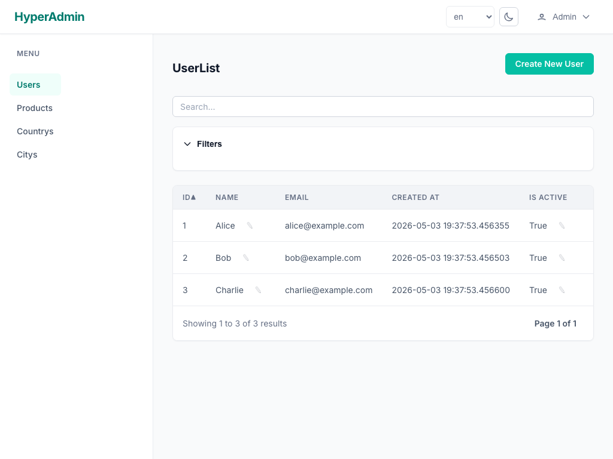

<div align="center">
  <a href="https://yevheniidehtiar.github.io/hyper-admin/" target="_blank">
    
  </a>
  <h1>HyperAdmin</h1>
  <p><strong>The Django-admin experience for FastAPI — generated straight from your Pydantic models.</strong></p>

  <p>
    <a href="https://yevheniidehtiar.github.io/hyper-admin/">
      
    </a>
    
    <a href="https://github.com/astral-sh/ruff">
      
    </a>
    
    <a href="LICENSE">
      
    </a>
    <a href="https://codespaces.new/yevheniidehtiar/hyper-admin?devcontainer_path=.devcontainer%2Fdevcontainer.json">
      
    </a>
  </p>

  <sub><strong>Alpha</strong> — under active development; APIs may change between releases.</sub>

  <br/><br/>
  
</div>

---

## The story

FastAPI gives you a fast API — but no batteries-included admin, the way Django has. So
every team rebuilds the same CRUD screens by hand, and they drift out of sync with the
models behind them.

HyperAdmin closes that gap. Point it at the Pydantic / SQLModel models you **already**
have and it generates a full admin — list, detail, create, update, search, filters,
auth — at a mount point in your existing app. No second schema to maintain, no JavaScript
build step. The models are the single source of truth; the UI can't drift from them
because it's derived from them.

It's built model-first (domain → logic → views → UI) and developed with an AI-assisted
[agentic workflow](https://yevheniidehtiar.github.io/hyper-admin/agentic-workflow/).

## Why the Pydantic stack

| Choice | Why |
|---|---|
| **Pydantic v2 / SQLModel** | Your models already encode types, validation, and field metadata. HyperAdmin reads them directly, so forms, filters and detail views are *generated*, never hand-written — and stay correct by construction. |
| **FastAPI** | Same async runtime, same dependency injection, same app. HyperAdmin mounts in; it doesn't take over. |
| **HTMX + Jinja2** | Server-rendered HTML with interactivity sent over the wire. A rich admin with a tiny JS surface — no SPA, no node build, progressive enhancement by default. |
| **SQLAlchemy 2.0 (async)** | A mature, async data layer underneath SQLModel — works with the databases you already run. |

## Quickstart

Not on PyPI yet — install from source:

```bash
pip install "git+https://github.com/yevheniidehtiar/hyper-admin.git"
```

```python
from fastapi import FastAPI
from sqlmodel import SQLModel, Field
from hyperadmin.admin import Admin
from hyperadmin.views import ModelView

class Product(SQLModel, table=True):
    id: int = Field(default=None, primary_key=True)
    name: str
    price: float

app = FastAPI()
admin = Admin()
admin.register_model(ModelView(Product))
admin.mount_to(app)          # full CRUD admin now live at /admin
```

Prefer to click around first? **[Open the demo in Codespaces](https://codespaces.new/yevheniidehtiar/hyper-admin?devcontainer_path=.devcontainer%2Fdevcontainer.json)** or browse the [screenshot tour](https://yevheniidehtiar.github.io/hyper-admin/demo/).

## Resource map

| | |
|---|---|
| 📖 **Documentation** | <https://yevheniidehtiar.github.io/hyper-admin/> |
| ▶️ **Live demo & tour** | [docs › Live Demo](https://yevheniidehtiar.github.io/hyper-admin/demo/) · [Open in Codespaces](https://codespaces.new/yevheniidehtiar/hyper-admin?devcontainer_path=.devcontainer%2Fdevcontainer.json) |
| 🚀 **Getting started** | [docs › Getting Started](https://yevheniidehtiar.github.io/hyper-admin/getting-started/) |
| 🧩 **Example app (ERP)** | [`examples/erp/`](examples/erp) · [docs › ERP](https://yevheniidehtiar.github.io/hyper-admin/examples/erp/) |
| 🗺️ **Roadmap** | [docs › Roadmap](https://yevheniidehtiar.github.io/hyper-admin/roadmap/) · [`ROADMAP.md`](ROADMAP.md) |
| 🏛️ **Architecture** | [`CONSTITUTION.md`](CONSTITUTION.md) — principles, module boundaries, dependency rules |
| 🤝 **Contributing** | [`CONTRIBUTING.md`](CONTRIBUTING.md) · [`CODE_OF_CONDUCT.md`](CODE_OF_CONDUCT.md) |
| 🔒 **Security** | [`SECURITY.md`](SECURITY.md) |
| 📓 **Changelog** | [docs › Changelog](https://yevheniidehtiar.github.io/hyper-admin/changelog/) |

## Tech stack

**[FastAPI](https://fastapi.tiangolo.com/)** ·
**[Pydantic v2](https://docs.pydantic.dev/)** ·
**[SQLModel](https://sqlmodel.tiangolo.com/)** / **[SQLAlchemy 2.0](https://www.sqlalchemy.org/)** ·
**[HTMX](https://htmx.org/)** ·
**[Jinja2](https://jinja.palletsprojects.com/)** ·
[Starlette](https://www.starlette.io/) sessions ·
[Argon2](https://argon2-cffi.readthedocs.io/) ·
[Babel](https://babel.pocoo.org/) i18n ·
[Typer](https://typer.tiangolo.com/) CLI ·
[uv](https://docs.astral.sh/uv/) + [Ruff](https://docs.astral.sh/ruff/)

## Development

```bash
just bootstrap   # set up the dev environment (uv sync --all-extras)
just lint        # ruff + mypy + commitizen
just test        # unit tests (just test-e2e for Playwright e2e)
just run-erp     # run the example ERP admin locally
just docs        # serve docs locally on :8080
```

## Acknowledgements

Standing on the shoulders of [Django](https://www.djangoproject.com/) (the original
batteries-included admin), [FastAPI](https://fastapi.tiangolo.com/),
[Pydantic](https://docs.pydantic.dev/), [HTMX](https://htmx.org/), and
[SQLModel](https://sqlmodel.tiangolo.com/) / [SQLAlchemy](https://www.sqlalchemy.org/) —
and built with AI-assisted development via [Claude](https://www.anthropic.com/).

## License

MIT — see [LICENSE](LICENSE).
