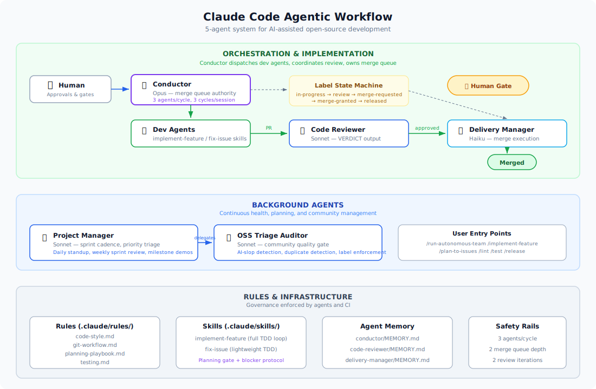

# Agentic Workflow

!!! abstract "Reusable Pattern"
    The agent roles, label state machine, orchestration, and safety rails described
    here are generic — they can be adopted by any OSS project using Claude Code.
    HyperAdmin-specific configuration (CONSTITUTION.md, review checklist, project IDs)
    is layered on top and clearly marked.

!!! tip "New here?"
    Start with the [Onboarding guide](onboarding.md) for a quick orientation.

This project follows a **5-agent Claude Code workflow** for AI-assisted open-source development. Each agent has a specific role, model tier, and output contract, orchestrated through `.meta/` files (GitPM) and GitHub PR labels.

## Architecture



## Component Relationships

```
Commands (user entry)              Skills (reusable workflows)           Rules (governance)
├─ /run-autonomous-team ──────→ conductor agent                         ├─ code-style.md
├─ /implement-feature ────────→ implement-feature skill ◄───────────────├─ git-workflow.md
├─ /plan-to-issues ───────────→ GitHub Issues                           ├─ planning-playbook.md
└─ /oss-triage-audit ─────────→ triage_audit.py                         └─ testing.md
                                                                              ▲
Agents (autonomous)                                                           │
├─ conductor ─────────────────→ implement-feature skill ──────── enforces ────┘
│                          └──→ code-reviewer agent ──────────── enforces ────┘
├─ delivery-manager ──────────→ merge execution
├─ project-manager ───────────→ oss-triage-auditor agent
├─ code-reviewer ─────────────→ VERDICT output (machine-readable)
└─ oss-triage-auditor ────────→ audit report
```

## Agents

| Agent | Model | Role | Trigger |
|-------|-------|------|---------|
| **Conductor** | Opus | Orchestrates team cycles, owns merge queue | `/run-autonomous-team` command |
| **Delivery Manager** | Haiku | PR monitoring, E2E tests, merge execution | Label filter (autonomous) |
| **Project Manager** | Sonnet | Sprint cadence, priority triage, health | Cron schedule |
| **Code Reviewer** | Sonnet | Architecture review against project rules | PR with `review` label |
| **OSS Triage Auditor** | Sonnet | Detect AI-slop, enforce labels, close stale | Ad-hoc or delegated by PM |

## Core Principles

- **Mandatory TDD**: Every functional change begins with failing tests. Implementation follows.
- **Bottom-Up Architecture**: Models → Business Logic → Views → UI (never the reverse).
- **Git-Native PM**: All issue/epic/milestone state lives in `.meta/` files, synced to GitHub via GitPM.
- **Label-Driven Coordination**: PR lifecycle managed via GitHub labels — no direct agent-to-agent messaging.
- **Human Checkpoints**: Approval gates between planning and implementation, and before release.

## Label State Machine

```
idea → researched → planned → approved → in-progress → review
                                                          ↓
                                    merge-requested → merge-granted → released
                                                  ↘ merge-deferred
```

Each label transition is owned by a specific agent or human:

| Transition | Owner |
|------------|-------|
| idea → researched | Deep research (Claude Opus) |
| researched → planned | Roadmap planning (Claude Opus) |
| planned → approved | **Human** |
| approved → in-progress | Conductor |
| in-progress → review | Dev agent (via implement-feature skill) |
| review → merge-requested | Delivery Manager |
| merge-requested → merge-granted | Conductor (merge queue authority) |
| merge-granted → released | Delivery Manager (executes merge) |

## Safety Rails

| Limit | Value | Purpose |
|-------|-------|---------|
| Dev agents per cycle | 3 | Prevent resource exhaustion |
| Cycles per session | 3 (9 issues cap) | Bound total work |
| Merge queue depth | 2 | Reduce conflict risk |
| Review iterations | 2 max | Escalate to human if stuck |
| Auto-revert | On CI failure post-merge | Protect main branch |
