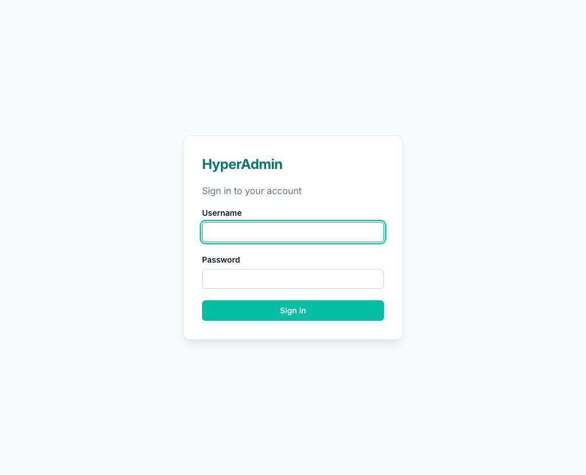
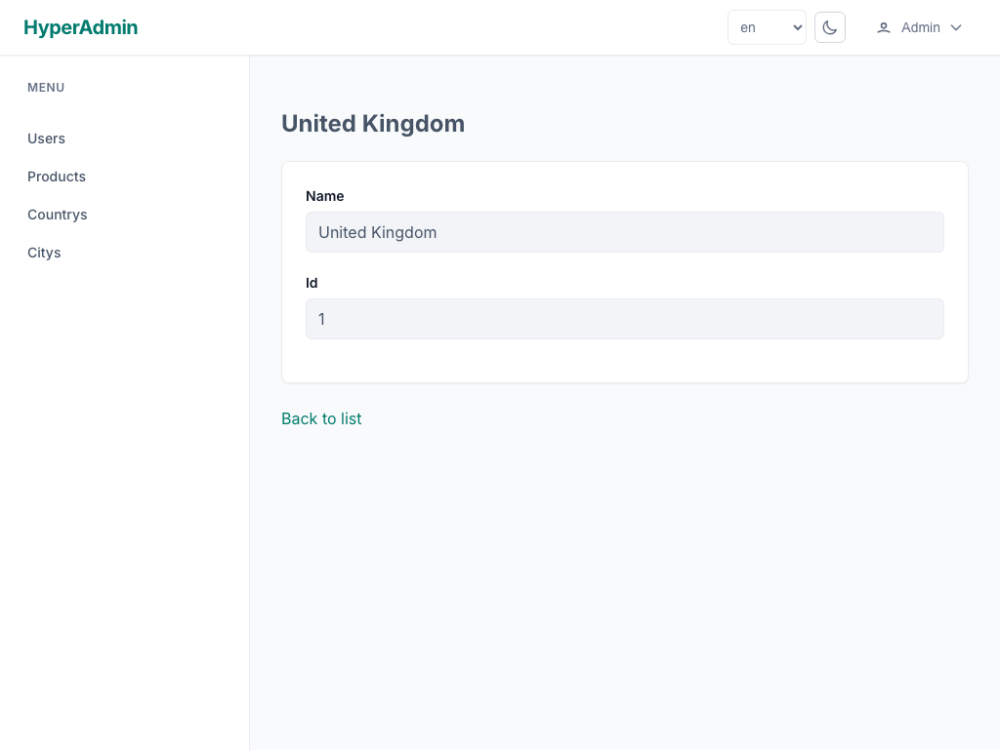
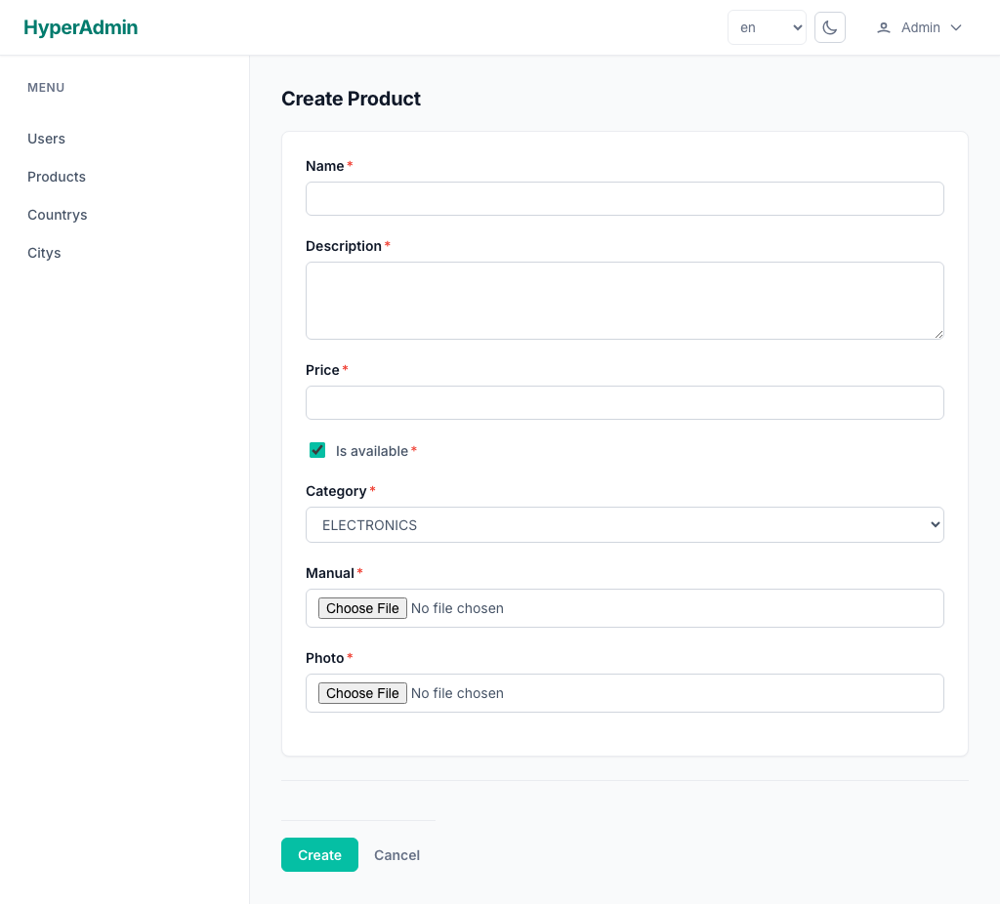
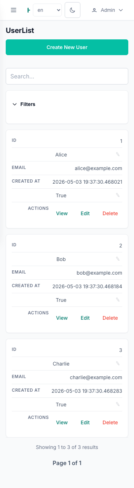

# Live Demo

HyperAdmin is a **server-side** admin framework — it renders pages with Jinja2,
serves HTMX requests from real FastAPI endpoints, and manages sessions. That means
a static host (like GitHub Pages, where these docs live) cannot run it: it needs a
Python process.

So this page gives you two ways to experience HyperAdmin:

1. A **screenshot tour** of the bundled ERP demo (below) — no setup, runs in your browser right here.
2. A **one-click live environment** via GitHub Codespaces, where the real app runs and you can click around.

---

## Try it live in Codespaces

[](https://codespaces.new/yevheniidehtiar/hyper-admin?devcontainer_path=.devcontainer%2Fdevcontainer.json)

Click the badge to launch a ready-to-run dev environment (dependencies install
automatically). Once it's up, start the ERP demo:

```bash
uv run fastapi dev examples/erp/main.py --host 0.0.0.0
```

Codespaces forwards port **8000** automatically — open the preview to use the admin.
The demo seeds itself on boot (a small SQLite database, `erp.db`), so you get a fully
populated bookkeeping app: contacts, sales, purchases, accounting, and reports.

> Log in with the seeded superuser (see `examples/erp/seed.py` for credentials).

---

## Screenshot tour

The screenshots below are the project's real end-to-end test baselines — exactly what
the framework renders.

### Login

Session-based authentication out of the box.



### List view

Sortable, searchable, paginated tables generated from your models — no boilerplate.


### Detail view

Per-record detail pages with related data and row actions.



### Create / edit form

Forms derived from your Pydantic/SQLModel fields, with server-side validation and
inline field errors.



### Responsive by default

The same UI adapts to small screens.

{ width="320" }

---

## Run it locally

The demo lives in [`examples/erp/`](https://github.com/yevheniidehtiar/hyper-admin/tree/develop/examples/erp).

### With Docker

```bash
cd examples/erp
docker compose up --build
```

### Without Docker

```bash
uv sync --all-extras
uv run fastapi dev examples/erp/main.py --host 0.0.0.0
```

Then open <http://localhost:8000/admin/>.

The app uses SQLite (`sqlite+aiosqlite:///erp.db`) and reseeds on startup, so it is
safe to delete `erp.db` and start fresh at any time.
